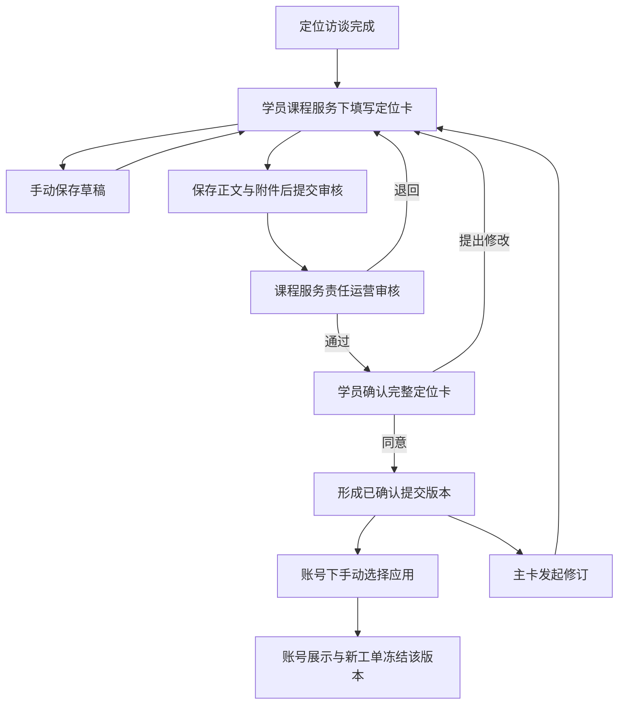

# 编导定位卡调整设计

## 目标

将编导定位卡调整为与访谈定位表单一致的逐行表单。每个字段由服务端模板配置，支持字段、提示、类型、字典、顺序、必填状态和素材选择规则配置。

## 初始字段与布局

初始字段完整纳入需求截图中的全部项目，按截图顺序逐行展示。表格列为：定位卡项目、填写提示、计划交付内容确定、参考账号与爆款。桌面端横向四列，移动端依次纵向展示。截图中的填写提示作为初始模板提示，可由管理员通过新模板版本调整。

账号名称建议、目标用户、客资提取方式、承接产品目标、学员加入目标、当前学习/资格阶段、主赛道、辅赛道、学员配合等级、连续可拍摄时间、出镜意愿、表达能力等级、专业优势和案例资产、信任证据、执行主要风险、7天账号数据、14天验证指标、28天调整触发条件、公司承担事项、学员承担事项、平台主页搭建建议、S0-S6期交付约定、内部交付目标建议等初始为文本字段。采访稿全文为附件字段。

历史定位、采访记录不是可编辑字段，读取系统已有历史记录和版本；无记录时显示空状态。

## 字典

- 账号定位：zsjos_persona_type，多选。
- 专业定位：zsjos_material_profession，多选。
- 主要内容形式：新增 zsjos_director_content_form 字典，多选，预置用户确认的22个选项。

字典选项由系统维护权限控制，权限标识可配置，不绑定总监角色或固定人员。本期不增加编导申请选项及总监审批路径。已保存记录保留选择值和当时的显示标签快照。

## 素材选择

平台主页搭建行选择完整的爆款账号素材；S1-S6交付约定行选择完整的爆款内容素材。选择弹窗使用现有素材库查询和权限边界，支持搜索、预览、多选、分页、确认、追加和移除。

抖音、小红书、视频号、其他平台主页搭建分别预置对应平台筛选；S1-S6分别预置对应适用阶段筛选。默认筛选可由编导调整或清空，仅影响本次选择。账号定位和专业定位可作为可选辅助筛选，多个值在同一维度内任一匹配，启用多个维度时同时匹配。

截图中的参考数量仅作推荐提示，不阻止草稿保存或正式提交。素材引用绑定具体素材版本，定位卡历史版本展示当时的素材快照，素材后续变化不覆盖已提交定位卡。

## 历史版本与提交

保存草稿只更新当前草稿，不产生历史版本。每次正式提交生成一个不可变历史版本；再次提交生成新版本，旧版本只读。历史版本按提交时的模板字段、字典标签快照、素材版本引用和附件元数据展示。

采访稿全文只允许上传附件，支持现有文件服务的上传、预览和下载能力；不自动关联访谈稿。

## 可配置边界

模板配置支持新增普通字段、修改标题和提示、字段类型、字典来源、排序、启停、必填、多选数量限制、素材类型、默认筛选、筛选可调整性和推荐数量提示。已发布模板通过复制草稿、保存、发布形成新版本；已提交历史不重新解释当前模板。

本期不实现新增字典审批、不实现自动账号数据采集或周期提醒、不实现字段级数据可见性限制。所有内容按现有页面和接口权限统一展示。

## 验收标准

1. 定位卡初始字段完整、顺序正确、桌面和移动端均逐行展示。
2. 三个字典字段读取正确字典且均可多选，预置内容形式完整。
3. 四个平台行和S1-S6行打开正确素材类型，默认筛选正确且可调整。
4. 素材可预览、多选、追加、移除，数量不足不阻止提交。
5. 草稿保存不生成历史版本，正式提交生成不可变版本，历史版本可查看。
6. 采访稿全文仅支持附件上传。
7. 模板配置和字典维护使用可配置权限，未绑定固定角色。
8. 无权限、加载失败、无结果、上传失败和移动端场景有明确状态。
# 对象层级决策（2026-09-13）

定位访谈以学员为主体；定位卡以学员及课程服务为归属。每项课程服务维护一张持续修订主卡，填写、提交和学员确认均不依赖账号，创建账号不再绑定草稿。历史多卡全部保留，由责任编导明确选择主卡后仅主卡可修订。多个账号可应用相同或不同已确认提交版本，新版确认仅提示可用，编导或运营在账号下手动换版。

## 单一填写来源决策（2026-09-17）

用户确认“定位访谈 → 填写定位卡 → 保存/提交/确认 → 账号概览只读引用同一卡”的流程。此决策替代此前将定位内容放入账号档案 POSITIONING 分区编辑的方案。账号档案字段配置不维护第二份定位表单；旧配置归档保留。草稿与生效提交分别展示，后续诊断实际结果不覆盖定位卡中的计划。当前代码和本地配置修正见 `docs/api/media-account-profile.md`；运行服务升级后的真实联调仍是交付验收要求。

### 定位卡手动保存（2026-09-17）

定位卡不再随输入、素材选择、附件选择、下载或关闭自动保存；资料预审维持原自动保存行为。底部提供“取消 / 保存草稿 / 保存并关闭 / 保存并提交审核”，JSON 导入仅填入表单，历史版本导入明确标为“导入并保存”。保存与历史导入互斥，保存期间禁用编辑和关闭。主表单和导入弹窗点击遮罩及 Escape 均不关闭；未保存的取消、关闭或重新加载须确认放弃修改。

附件先作为本地 File 暂存，不进入草稿请求。显式保存新卡时先创建草稿取得 ID，再逐个上传，最后保存附件 ID；已有卡直接上传并保存关联。上传成功即将本地待上传项替换为 ID，失败重试不重复上传已成功项，每次草稿写入使用上次响应版本。该多请求过程不是原子事务：部分失败可能已创建草稿或上传文件，但未完成关联，必须保留现场并重试；不自动删除存储文件。

真实版本冲突保留输入，不自动覆盖或重新加载；复制内容会以文件名标识待上传附件，不包含文件字节。重新加载经放弃确认后读取最新草稿。附件下载仅调用 GET，不写草稿。后端附件上传的非责任编导错误使用 POSITIONING_CARD_PERMISSION_DENIED（1900014004），不再误报版本冲突；手动保存阶段沿用既有接口和租户权限；后续独立定位卡功能的数据库变更见 V258 契约。

## 2026-09-17 独立提交与手动应用

本节取代旧账号归属及自动生效规则。完整接口、权限、历史兼容和上线顺序见 [独立定位卡契约](../../api/positioning-service-application.md)。运营审核及学员确认沿用现有业务路径，不新增审批层级。

